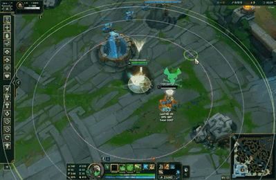
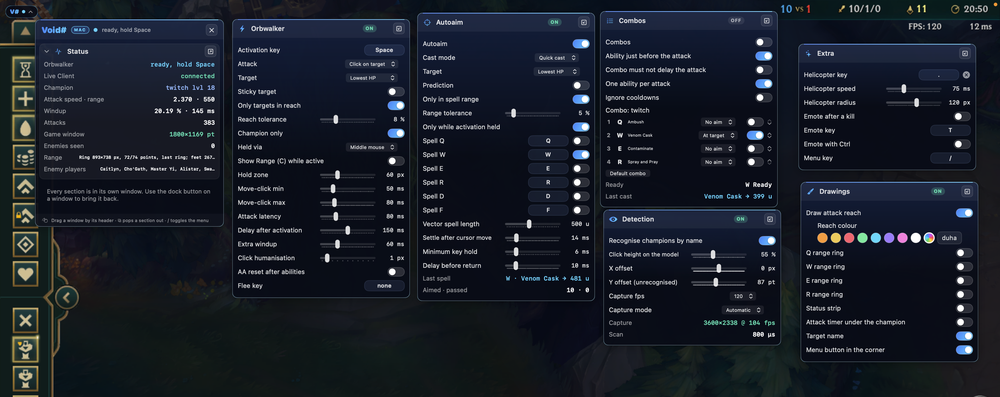
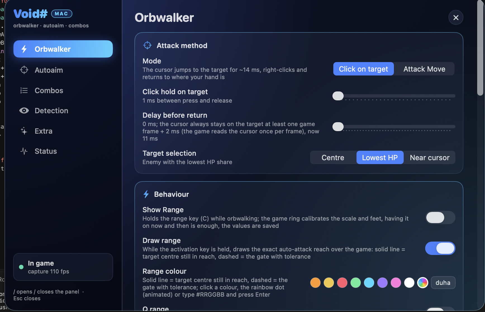

# Void#

A native orbwalker and autoaim for League of Legends on Apple Silicon Macs, written in Swift.

**It never reads or writes game memory.** Everything comes from four public sources: the screen
(ScreenCaptureKit), Riot's Live Client Data API on `127.0.0.1:2999`, published champion/spell data,
and synthesized input. There is no injection, no hooking and no process access.

## Demo



Orbwalking and combos in a practice game.

### In-game menu



### Settings panel



## Requirements

- macOS 14+ on Apple Silicon, Swift 5.9 toolchain (`xcode-select --install`)
- League of Legends running on the same Mac
- Three permissions, granted on first launch: **Accessibility**, **Screen Recording**, **Input Monitoring**

## Quick start

```bash
git clone https://github.com/sajmonekk191/VoidMac.git
cd VoidMac
./run.sh          # builds, packages build/VoidMac.app, launches it
```

The app lives in the menu bar (scope icon). Grant the three permissions when macOS asks, then restart it once.

## Controls

| Key | What it does |
|---|---|
| **Space** (hold) | Orbwalk: attack → stand through the windup → move-click → attack again at 1/attack speed |
| **Q W E R** (+ D F) | With autoaim on, the spell is aimed at the predicted target and the cursor returns to your hand |
| **Right ⌘** | Open/close the panel; while it is open everything is paused |
| **C** | Hold to show attack range (bound to the game's own range key) |
| **'** | Attack champions only |
| **3** | Emote after a kill |
| **V** (hold) | Waveclear: kite as usual, but every attack is an attack-move, so the game hits the nearest unit |
| **X** (hold) | Last hit: kite to the cursor and attack only minions one hit kills now |

Heal and Barrier need no key: with Auto Heal on they go out by themselves at low health. The helicopter is unbound by
default. Every key is rebindable in the panel.

## What it does

- **Orbwalks** with per-champion windup data (172 champions), so the attack is never cancelled early and the
  move-click goes out the moment the windup is done.
- **Tracks targets from health bars** — one pass over the frame finds enemy bars, your own bar and the level box;
  a track keeps its identity for 1.5 s and its speed is fitted by regression over the last 160 ms.
- **Aims spells** at where the target will be, with a confidence from how linear its motion is; vector spells
  (Viktor E, Rumble R) are drawn with two points.
- **Weaves abilities between attacks** and reads whether each one is castable from the gold border of its HUD icon,
  falling back to a cooldown estimate from your own casts, the ability rank and ability haste.
- **Learns the click depth per champion**: a hit proves the body reaches that far below the health bar, two misses
  put the feet higher, and the estimate settles between them.
- **Calibrates itself from the attack-range ring** the game draws, which gives the pixels-per-unit and the ground
  perspective without any hardcoded resolution.
- **Attacks by priority** when the target mode is Priority: you order the match's enemy champions once, the order is
  kept per champion for later games, and champions never ordered follow by class (marksmen first, tanks last).
  Autoaim can follow the same list.
- **Last-hits minions**. Enemy minion bars are found by their exact anatomy (a four-to-eight-row red gradient inside a
  dark border, 122 px wide at 3600 px), followed frame to frame, and their health loss is measured. An attack goes out
  only when one hit kills the minion at the health it has *now* and it still lives when the hit lands (latency, the windup
  and the missile's flight for your champion against the damage other units deal): their damage comes in lumps, so a hit
  sent on a forecast of it lands early and leaves the minion to them. With LoL's own Last Hit Assist on
  (Interface → Health and Resource Bars → Show Last Hit Assist), the red fill starts with a darker one-shot part whose end
  is read as the threshold, and a bar one attack kills turns white; the assist leaves armor out, so its threshold is cut
  by the armor of the minion's kind, which the part sizes give away (caster, melee and cannon parts fall into clusters).
  The super minion's 1.5× wider bar is read too. Ranked has no assist, so there the damage is
  computed from your attack damage, Doran's/Tear +5, and the minion's health and armor by type and game time. Every hit
  that leaves a minion alive tells its type and corrects the model; a kill is confirmed by its gold bounty.
- **Casts Heal or Barrier** when health falls to the threshold while you are losing it, carrying the current loss rate
  forward. Whether the spell is ready is read from the golden frame of its D/F icon in the HUD, so a spell on cooldown
  is never pressed.
- **In-game menu** in the style of injected scripts: collapsible sections, each poppable into its own floating
  window, plus optional HUD overlays (status pills, an attack timer under your champion, the target's name).

## How it works

| Layer | Detail |
|---|---|
| Capture | ScreenCaptureKit window stream at native resolution, 120 fps in a match, 12 fps outside; a new frame wakes the waiting threads through a condition variable |
| Detection | One pass per frame (every 9th row at 2x): red fill + outline above and below + the level box; ~0.22 ms on a 3600×2338 frame, ~0.28 ms per frame for the whole vision step |
| Minions | A second pass for minion bars, run every frame while farming and every fourth frame otherwise (only when last hitting is set up): ~0.14 ms at 3600 px wide (~0.31 ms while the game's assist is on, when white bars are searched too), the bottom HUD and the minimap left out |
| Timing | The orbwalker and vision threads run under a real-time (time-constraint) policy and wait on `mach_wait_until`; a background process otherwise gets its timers coalesced by up to 100 ms |
| Game state | Attack speed and range, attack damage and lethality, items, gold, health, champion, death, summoner spells and game time come from the Live Client API (health 50× a second under half health) |
| Data | 692 spells (targeting, range, speed, cast time, cooldown, cost), 172 champion windups, and per champion missile speed, class and ARAM damage, generated from Data Dragon, CommunityDragon and the wiki |

## Layout

```
Sources/VoidMac/      the app: capture, detection, orbwalker, autoaim, combos, UI
Tests/VoidMacTests/   unit tests (`swift test`) on synthetic frames: detection, ring fit, ground flow, settings, timing
Tools/                generators, log analysis, the HUD regression check, the vision benchmark, packaging
media/                the gameplay loop and the UI screenshots used above
CLAUDE.md             the full engineering write-up (in Czech): every subsystem and why it is built that way
```

Config lives in `~/Library/Application Support/VoidMac/config.json`, the log in `~/Library/Logs/VoidMac.log`.

## Development

```bash
swift build -c release                        # build only
swift test                                    # unit tests, no game needed
Tools/analyze-log.py --last 3                 # per-session report: cadence, combos, misses, HUD state, last hits, Heal/Barrier
Tools/hud-regression-check/check.sh           # replays labelled frames through the real HUD reader
Tools/vision-bench/bench.sh --write golden.txt   # time every detector on the recorded frames, keep their results
Tools/vision-bench/bench.sh --check golden.txt   # after a change: same timings, and FAIL if any result differs
.build/release/VoidMac --analyze frame.png --hud Ashe    # offline: locate the ability icons in a screenshot
.build/release/VoidMac --ui-shot out/         # render the in-game UI to PNGs without a game
python3 Tools/generate_spells.py              # regenerate the spell table for a new patch
python3 Tools/generate_combat.py              # regenerate missile speeds, classes and ARAM damage from the wiki
```

The regression check is not optional: the HUD reader decides when a combo may cast, and two changes to it have
already shipped broken. It replays frames with known answers through the real reader and fails on both of them.
Performance work goes through the vision benchmark the same way: a speed-up counts only when `--check` still
reports every scan, ring fit and ground-flow result identical to the golden file taken before the change.

## Limits

- Verified on a 3600×2338 (Retina 2x) game window; other resolutions rely on the ring calibration and are less tested.
- Minion bars were measured on 3600-wide frames only. The Last Hit Assist's look (the darker one-shot part, the white bar)
  was measured on in-game frames; the first frame of each look is saved as `lasthit-assist-mark-*.png` and
  `lasthit-assist-white-*.png`, and while farming a `farm-*.png` every 20 s (six per launch) to check for missed bars.
  A bar whose start or end hides behind another bar cannot be measured.
- Without the game's assist, a minion's type is unknown until your first hit on it, so the sturdier of melee and caster
  is assumed. A cannon can survive that first hit; after it the type is known.
- Champion identification reads the name plate above the bar, so it needs the name to be visible at least once.
- Full-screen mode delivers no window frames, so capture falls back to display capture with a source rect.

## Disclaimer

Automating input in League of Legends violates Riot's Terms of Service and can get the account banned.
This is a personal project published for reference; use it at your own risk.
